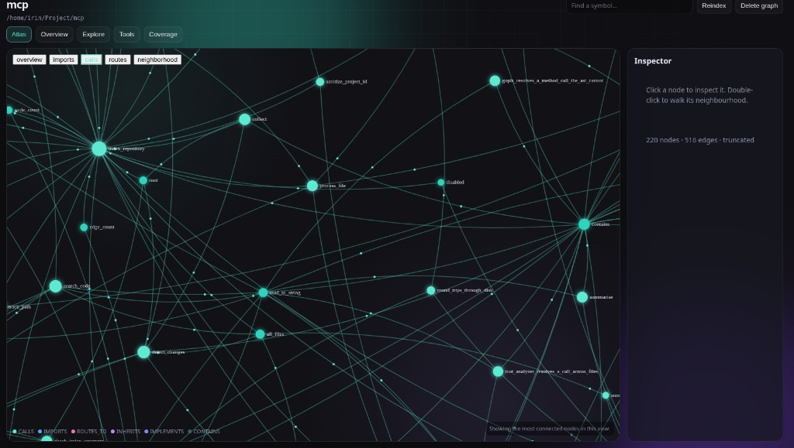

# Loci

<p align="center">
  
</p>

<p align="center">
  <strong>Local-first code intelligence for AI coding agents.</strong><br>
  Indexes a repository into a persistent graph on disk and serves it to
  <a href="https://cursor.com">Cursor</a> over the
  <a href="https://modelcontextprotocol.io">Model Context Protocol</a>,
  so an agent can ask <em>what calls this?</em> instead of grepping and guessing.
</p>

<p align="center">
  <a href="https://github.com/bodsink/loci/actions/workflows/ci.yml"></a>
  
  
  
  
</p>

Everything runs on your machine. No cloud, no API key, no language runtime. Your source is read,
parsed, and left where it is — only structure (names, paths, line ranges, relationships) is stored.



**Status: milestone 1, plus the follow-up work.** Indexing, the graph, all 15 MCP tools, the
Cursor integration, and a local web UI work today. Hybrid LSP is implemented and off by default;
every edge records whether it came from the AST or from a language server. See
[Honest limits](#honest-limits).

## What you get

| | |
| --- | --- |
| Persistent graph | Symbols and edges in `graph.redb`, not a one-shot parse |
| 15 MCP tools | Structural questions first; grep is the fallback |
| Local web UI | The same graph in a browser: atlas, routes, coverage, tools |
| 21 languages | tree-sitter grammars linked into one binary |
| Incremental index | Unchanged files skipped by content hash |

Ask the agent something structural — *"what calls `create_order`?"* — and it will reach for
`list_projects` and `trace_path` on its own. Or open the same graph yourself with `loci ui`.

## Install

Requires a Linux x86_64 machine and a Rust toolchain to build.

```bash
git clone https://github.com/bodsink/loci.git loci && cd loci
cargo build --release
```

A release build writes `target/release/loci` and copies it to `~/.local/bin/loci`, which is the
`loci` on `PATH`. `cargo build` (debug) does not; a crate in `release/deps` does not.

`./target/release/loci install` still registers the server in `~/.cursor/mcp.json` (and copies the
binary if you built on a machine that never produced a release `loci` here). Other MCP servers in
that file are left alone. If `~/.local/bin` is not on `PATH`, `install` says so and prints the
line to add.

Then index a repository and reload MCP servers in Cursor (Settings → MCP → refresh):

```bash
loci index /path/to/your/repo
loci ui
```

## CLI

| Command | What it does |
| --- | --- |
| `loci install` | Register the server in Cursor's `mcp.json` (and copy the binary if PATH is stale) |
| `loci index <path>` | Index or re-index a repository (incremental by default, `--full` to force) |
| `loci status [project]` | Show what is indexed; with no argument, list every project |
| `loci query --project <id>` | Search the graph for symbols |
| `loci changes --project <id>` | Show which files changed since the last index run |
| `loci delete <project>` | Delete a project's graph; the source repository is untouched |
| `loci mcp` | Serve MCP over stdio (Cursor starts this for you) |
| `loci ui` | Open a local web UI for the graph, per project |

Add `--json` to any command for machine-readable output.

## Web UI

`loci ui` serves a page on loopback (`http://127.0.0.1:7420` by default) and opens it in the
browser. `--bind`, `--port`, and `--no-open` are the only flags. Nothing is uploaded; the process
reads the same catalog and graph files as `loci mcp`.

From the page you can add a project (an absolute `repo_path`, optional name), switch between
indexed projects, and:

- walk a force-directed atlas (calls, imports, routes, or a symbol neighbourhood)
- read the architecture counts, HTTP routes, and coverage
- search symbols, open a snippet, and trace callers
- invoke any of the 15 MCP tools with the same arguments the agent uses

Reads take a shared lock on `graph.redb`, so the UI and Cursor's MCP server can inspect a
project at the same time. An index run still takes an exclusive lock; if one is in progress the
UI says so and you retry when it finishes.

## Where data lives

Under `$XDG_DATA_HOME/loci` (default `~/.local/share/loci`), never inside your repository:

```
~/.local/share/loci/
├── catalog.json                    # which projects are indexed, and where
├── agent_calls.jsonl               # local journal of MCP tool calls
└── projects/<project-id>/graph.redb
```

The graph stores symbol names, file paths, and line ranges — not file contents.
`get_code_snippet` re-reads the file from disk at call time, which is also why a snippet is never
stale relative to the graph. `loci delete` removes a project's store; deleting the whole directory
resets Loci completely.

Reads are confined to the project root you indexed. Symlinks that resolve outside it are rejected,
and `.gitignore` is honoured.

## The 15 MCP tools

**Orientation** — `list_projects`, `index_repository`, `index_status`, `delete_project`,
`get_graph_schema`, `get_architecture`

**Structural discovery** — `search_graph` (find symbols), `query_graph` (multi-hop edge walks),
`trace_path` (callers and callees), `get_code_snippet` (exact source for a symbol)

**Trust and freshness** — `check_index_coverage` (was this path actually indexed?),
`detect_changes` (what moved since the last index?)

**Everything else** — `search_code` (literal and regex text), `manage_adr` (decision records bound
to graph symbols), `ingest_traces` (attach runtime call data)

Every response carries concrete file paths and line ranges, paginates with `has_more`/`cursor`, and
reports empty results as empty.

See [`docs/cursor-agent.md`](docs/cursor-agent.md) for how the tools are shaped around the way
Cursor's agent actually behaves.

### Graph schema

16 node labels (`Function`, `Method`, `Class`, `Route`, `Field`, `Adr`, …) and 13 edge types
(`CALLS`, `CALL_UNRESOLVED`, `IMPORTS`, `INHERITS`, `IMPLEMENTS`, `ROUTES_TO`, `IMPACTS`, …). Call
`get_graph_schema` for the authoritative list — it is generated from the same constants the engine
uses, so it cannot drift from the implementation.

Qualified names are dot-separated in every language: the module path from the file, then each
enclosing definition, then the symbol. For example
`services.orders-py.app.service.OrderService.create_order`.

### Import resolution

Source almost never spells an import the way the graph stores a file. TypeScript writes `@/types`,
Dart writes `package:app/models/user.dart`, Go writes `github.com/you/svc/internal/domain`. Matching
that text against file names resolves close to nothing, and the failure is silent: on the project
this was measured against, `frontend/src/types/index.ts` was imported by 941 files and had an
in-degree of **zero**. "Who uses this, what breaks if I change it" answered empty, which looks the
same as "nothing uses this".

So the indexer reads the manifests that define those spellings — `tsconfig.json` (or `jsconfig.json`)
for path aliases, `pubspec.yaml` for the Dart package name, `go.mod` for the Go module path — and
resolves an import to a repository path before looking it up. Relative imports are resolved against
the importing file's own directory, an omitted extension is filled back in, and a directory import
lands on its entry point (`index`, `mod`, `main`, `__init__`). A `tsconfig.json` is read as JSONC,
because real ones carry comments and trailing commas, and its `extends` chain is followed for
inherited mappings.

An alias only applies inside the project whose manifest declares it, and a repository may hold
several: the one measured here has four `go.mod` files, and an import lands in the module that
declares it rather than whichever was read first. Targets outside the repository — `react`,
`dart:async`, `fmt`, `github.com/gin-gonic/gin` — produce no edge at all.

Go is the one language whose import names a package rather than a file, so it points at a `Package`
node named by its import path. Pointing it at every file of the package instead was tried and
measured: one package of 141 files with 456 importers produced 64,296 edges on its own, claiming a
dependency on each file when the importer used a single type. A package node is the only node no
file owns, so it is removed when its directory stops holding Go files.

On that project the change added 16,378 import edges and 93 package nodes. `internal/domain` now has
an in-degree of 456, matching its importer count in source exactly; `frontend/src/types/index.ts`
has 971, being the 941 alias imports plus relative ones. Full-index edge building went from 2,414 ms
to 2,576 ms, and an incremental run from 35 ms to 72 ms.

Languages whose imports genuinely name a module rather than a path — Python, Rust, Java — keep
resolving by dotted module name, which was already correct for them.

## Languages

Twenty-one language IDs have a real tree-sitter grammar linked into the binary.

Code: Python · JavaScript · JSX · TypeScript · TSX · Go · Rust · C · C++ · Java · C# · Kotlin ·
Perl · Shell · Dart

Configuration: TOML · YAML · INI

Build: Make · CMake

Markup: HTML

Every language named for Hybrid LSP is in that list, so no language the engine advertises can turn
out to be unparseable. The reverse no longer holds: shell, configuration, build and markup files are
parsed but have no server in scope, and `hybrid_lsp_eligible` reports false for them.
`get_graph_schema` reports the list with the upstream crate behind each grammar so it can be
audited. PHP is out of scope by design and CI fails if it reappears.

Shell is included because packaging trees are mostly shell: build scripts, and Debian maintainer
scripts like `postinst` that carry no extension at all. Those are found by their `#!` line, which is
read only for extensionless files. `source lib.sh` and `. lib.sh` become import edges rather than
calls to a function named `source`, with the target resolved against the script's own directory.

Route extraction currently recognises FastAPI, Express, net/http, Gin and Echo, axum, and ASP.NET
attribute routes. Other frameworks produce no `Route` nodes rather than guessed ones.

How each language is extracted — Dart mixins, Makefile targets, Qt moc, JSX `&`, Go route groups
and receiver types — is in [`docs/languages.md`](docs/languages.md), with the measurements that
decided those labels. Hybrid LSP is in [`docs/hybrid-lsp.md`](docs/hybrid-lsp.md).

## Honest limits

These are stated because an agent that trusts a wrong answer is worse than one that knows it needs
to check.

- **Hybrid LSP is off by default.** Indexing is AST-first, and with the default settings every edge
  carries `source: "ast"`. A call that needs type information stays `CALL_UNRESOLVED` rather than
  being guessed: in the fixture, C#'s `_store.Persist(invoice)` resolves to nothing because two
  types declare `Persist`, and only a type checker can say which one `_store` is. Pass `--lsp`
  (CLI) or `hybrid_lsp: true` (MCP) to ask an installed language server about exactly those calls;
  the resulting edges carry `source: "lsp"`. It stays off by default because starting a server
  turns a 300 ms run into a multi-second one. Only servers you already have on PATH are used, and a
  missing one is reported, never fatal.
- **Unresolved calls are labelled, not hidden.** When a call site cannot be pinned to a definition,
  it becomes a `CALL_UNRESOLVED` edge with a reason. Absence of a `CALLS` edge is not evidence that
  no call exists.
- **An unresolved import is silent, unlike an unresolved call.** An import that points outside the
  repository, or that a manifest does not explain, produces no edge and no marker. That is right for
  a third-party package, but it means a missing `IMPORTS` edge does not prove the dependency is
  absent — only that nothing indexed matched it. Aliases declared somewhere other than
  `tsconfig.json`, `jsconfig.json`, `pubspec.yaml` or `go.mod` (a bundler config, for instance) are
  not read.
- **Coverage is best-effort.** `check_index_coverage` tells you what was indexed and what was
  skipped and why. It does not prove a file was fully understood. The skipped sample shows one
  representative per directory and reason, largest group first, with a count of what it stands for,
  so a folder of twenty icons cannot crowd out every other reason a file was left out and the
  biggest gap cannot fall off the end of the list.
- **Linux x86_64 only.** macOS and Windows are not built or tested; CI covers Linux alone rather
  than listing platforms it does not verify.

## Performance

Measured on the maintainer's machine, release build. These are observations, not guarantees.

Indexing this repository itself (40 source files, 573 nodes, 3897 edges):

| | Time |
| --- | --- |
| Cold full index | 291 ms |
| Re-index, nothing changed | 56 ms |
| Re-index after editing one file | one file re-parsed, rest skipped by content hash |

Warm query latency on the sample fixture, 2000 iterations each:

| Query | p50 | p95 |
| --- | --- | --- |
| `search_graph` by exact name | 0.005 ms | 0.009 ms |
| `search_graph` by qualified name | 0.005 ms | 0.005 ms |
| `trace_path`, depth 3 | 0.013 ms | 0.018 ms |
| `search_graph` by prefix regex | 0.031 ms | 0.047 ms |

Structural queries are comfortably under the 1 ms target, but latency scales with the number of
matches returned — a broad pattern is slower than an exact name. Run `cargo run --release -p
loci-bench` to reproduce on your own hardware.

### At scale

Measured on a real 35k-file tree (a Go module cache: 34,631 Go files plus C, C++, Java, JavaScript,
Perl and Python), producing 608,713 nodes and 3,759,839 edges:

| | Before | Now |
| --- | --- | --- |
| Cold full index, 52,299 files parsed | 200 s | 189 s |
| Re-index with 121 of 52,299 files changed | 80 s | 10 s |
| — of which cross-file edge rebuild | 58 s | 0.33 s |

`loci index` prints a per-phase breakdown, so a slow run can be attributed rather than guessed at:

```
phases : walk 594 ms, hash 1123 ms, parse 36 ms, load 5789 ms, edges 327 ms, lsp 0 ms, report 407 ms
```

The re-index used to rebuild all 3.7M edges on every run. It now rebuilds only the files whose own
facts changed plus the files that reference a symbol those files defined, which is what correctness
actually requires. `crates/loci-index/tests/incremental_equivalence.rs` walks a fixture through a
body edit, a new definition, a deleted definition, a rename and a file removal, asserting after each
step that the incrementally maintained graph is identical to one rebuilt from scratch. On the 35k
tree, an incremental run and two full rebuilds all produce the same 3,759,839 edges.

Two limits remain, both measured rather than assumed:

- **Full-index throughput is about 277 files/s**, dominated by parsing (155 s of the 189 s).
  Extrapolated to the 75k-file
  Linux kernel that is roughly 4.5 minutes, not the 3 minutes the product target asks for. The kernel
  itself has still not been indexed here, so that remains an estimate, not a result.
- **Incremental runs have a ~6 s floor on this tree**, almost all of it loading 608,713 nodes and
  every file's facts to build the symbol table. That is independent of how little changed.

#### A bug this uncovered

Comparing runs exposed something worse than slowness: two full indexes of the *same* unchanged tree
disagreed on the edge count (3,759,761 then 3,759,780). Structural edge ids were a 31-bit hash of
`(src, dst, type)`. At 608k structural edges the birthday bound makes collisions certain, and each
collision silently overwrote a `DEFINES` or `CONTAINS` edge, so a symbol lost its parent. Node ids
shift between runs, so a different set of edges was lost each time. Structural ids now come from a
counter, and two full rebuilds of that tree produce byte-identical edge counts.

Because ids are now allocated rather than derived, the schema version moved to 2; graphs written by
an older build are rebuilt automatically on the next index.

## Development

```bash
cargo test --workspace                     # 139 tests
cargo clippy --workspace --all-targets -- -D warnings
cargo run --release -p loci-bench          # indexing and query benchmarks

# Exercise all 15 tools against the real binary over stdio, as Cursor does
LOCI_DATA_DIR=$(mktemp -d) python3 scripts/mcp_smoke.py \
  ./target/release/loci "$PWD/fixtures/sample" smoke
```

`fixtures/sample` is a small multi-language repository (Python, TypeScript, Go, Rust) with HTTP
routes and cross-file calls, used by both the tests and the benchmark.

### Layout

| Crate | Responsibility |
| --- | --- |
| `loci-core` | Errors, language IDs, sandboxed paths, data directories |
| `loci-graph` | redb-backed store, schema, queries, coverage, catalog |
| `loci-parse` | tree-sitter grammars and per-language extraction queries |
| `loci-index` | Walking, hashing, symbol and import resolution, incremental indexing |
| `loci-lsp` | Language server detection (resolution not yet implemented) |
| `loci-mcp` | JSON-RPC over stdio, the 15 tools, usage journal |
| `loci-cli` | The `loci` binary, including `loci ui` and its embedded page |

## License

Apache-2.0. See [LICENSE](LICENSE).
